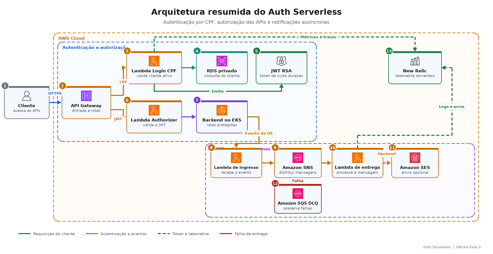

# Oficina Fase 3 — Auth Serverless

Documentação da autenticação por CPF, do API Gateway e das notificações serverless. A visão completa da Oficina está no [repositório central](https://github.com/tiagomiele/backend).

Projeto de implementação: [fiap-tech-challenge-fase3-oficina-auth-serverless](https://github.com/tiagomiele/fiap-tech-challenge-fase3-oficina-auth-serverless)

## Visão de negócio

O Auth permite que um cliente ativo acesse com segurança as funcionalidades relacionadas às suas Ordens de Serviço sem utilizar uma senha criada pela oficina. O CPF identifica o cadastro; um JWT de curta duração representa a sessão autorizada e protege consultas e decisões do cliente.

O mesmo projeto desacopla as notificações da execução da OS. Assim, o atendimento principal não depende do tempo de entrega de e-mail e falhas podem ser repetidas ou encaminhadas para uma fila de erro.

## Responsabilidades

- validar e normalizar o CPF;
- consultar existência e situação ativa do cliente no PostgreSQL;
- emitir e validar JWT RSA de curta duração;
- proteger rotas do cliente com Lambda Authorizer;
- controlar e rotear requisições pelo API Gateway;
- receber notificações técnicas, publicá-las no SNS e tratar falhas pela DLQ;
- entregar por log técnico ou SES opcional, sem expor CPF, token ou mensagem nos logs;
- publicar logs estruturados, correlação e telemetria New Relic;
- provisionar os componentes serverless com Terraform.

Regras da Ordem de Serviço permanecem no Backend; EKS e RDS pertencem aos respectivos projetos de infraestrutura.

## Arquitetura do componente



## Modelo arquitetural e práticas

O projeto utiliza uma separação leve inspirada em Clean Architecture, adequada a funções serverless:

- `domain`: CPF e regras independentes da AWS;
- `application`: contratos exigidos pelo caso de autenticação;
- `handler`: adaptadores de entrada das Lambdas;
- `infrastructure`: PostgreSQL e serviço de JWT;
- `notification` e `observability`: mensageria, entrega, logs e telemetria.

Ele não replica os quatro anéis do Backend. Cada Lambda possui responsabilidade delimitada, dependências externas ficam atrás de interfaces e os fluxos são cobertos por testes unitários. Spotless, Terraform Validate, TFLint, Trivy, Gitleaks e revisão por Pull Request apoiam Clean Code, segurança e consistência.

## Stack e ferramentas

| Área | Tecnologias |
|---|---|
| Aplicação | Java 21 e Maven Wrapper |
| APIs e segurança | API Gateway v2, AWS Lambda, Lambda Authorizer e JWT RSA |
| Integração | PostgreSQL, Amazon SNS, SQS/DLQ e SES opcional |
| Infraestrutura | Terraform, HCP Terraform e AWS Academy `LabRole` |
| Qualidade | JUnit, Spotless, TFLint, Trivy, Gitleaks e actionlint |
| Entrega | GitHub Actions, GitHub Environments e sincronização de outputs |
| Observabilidade | Logs JSON, mascaramento de PII, correlação e New Relic serverless |

## Execução e deploy

Validação local do projeto original:

```bash
./mvnw -B verify spotless:check
terraform fmt -check -recursive
terraform init -backend=false -input=false -lockfile=readonly
terraform validate
```

Pull Requests executam CI e Terraform Plan sem criar recursos. O merge em `homolog` implanta homologação; a promoção para `main` executa produção com proteção do GitHub Environment. O deploy empacota as Lambdas, aplica o Terraform e sincroniza as URLs resultantes com o Backend.

- [Implantação e operação](docs/implantacao-operacao.md)
- [CI/CD integrado da solução](https://github.com/tiagomiele/backend/blob/documentation/docs/cicd-promocao.md)
- [Bootstrap AWS](https://github.com/tiagomiele/backend/blob/documentation/docs/bootstrap-aws-do-zero.md)

## Documentação técnica

- [Arquitetura serverless](docs/arquitetura.md)
- [Fluxo central de autenticação](https://github.com/tiagomiele/backend/blob/documentation/docs/architecture/autenticacao.md)
- [RFC de autenticação](https://github.com/tiagomiele/backend/blob/documentation/docs/decisions/rfc/0003-autenticacao-cpf-jwt.md)
- [ADR de comunicação assíncrona](https://github.com/tiagomiele/backend/blob/documentation/docs/decisions/adr/0002-comunicacao-assincrona.md)

## OpenAPI e Postman

- [Contrato OpenAPI de autenticação e rotas protegidas](https://github.com/tiagomiele/fiap-tech-challenge-fase3-oficina-auth-serverless/blob/main/docs/openapi/oficina-auth.yaml)
- [Collection Postman integrada](https://github.com/tiagomiele/fiap-tech-challenge-fase3-oficina-backend/blob/main/tests/postman/oficina-weeks4-5.postman_collection.json)

A URL efetiva do API Gateway é gerada pelo Terraform e deve ser atualizada após cada reconstrução do AWS Academy.
