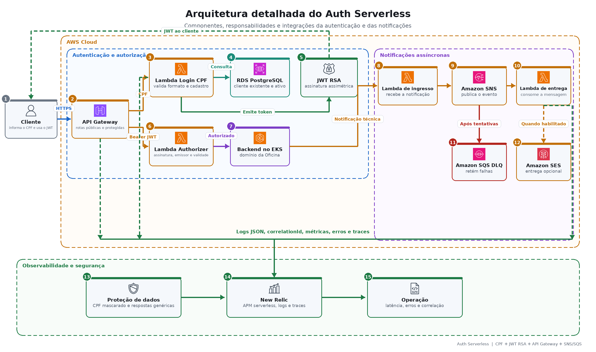

# Arquitetura Auth Serverless

## Componentes

- **Login CPF:** valida formato e dígitos, consulta cliente ativo e emite JWT.
- **Authorizer:** valida JWT antes das rotas protegidas.
- **API Gateway:** publica autenticação, roteia Backend e recebe notificações técnicas.
- **SNS e Lambda de entrega:** desacoplam processamento e entrega.
- **DLQ:** preserva eventos após falhas de processamento.
- **SES opcional:** envio real quando permitido; no AWS Academy o modo técnico por log continua válido.
- **New Relic:** APM serverless, erros, latência e correlação.

## Segurança

JWT RSA de curta duração, CPF mascarado, respostas genéricas de autenticação, logs estruturados sem PII e integração técnica protegida.
