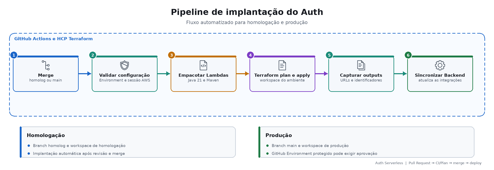

# Implantação e operação

## CI

Pull Requests e pushes validam Java, testes, arquitetura, Terraform e segurança. Nenhum recurso é criado pelo CI.

## Terraform plan

Pull Requests para `homolog` ou `main` calculam as mudanças do ambiente correspondente, sem apply.

## Deploy

- `homolog` utiliza workspace e GitHub Environment de homologação.
- `main` utiliza workspace e Environment `production` protegido.
- O apply cria Lambdas, API Gateway, rotas, Authorizer, SNS, DLQ e telemetria.
- As URLs resultantes são sincronizadas com o Backend.

## Evidência

[Deploy de Auth concluído](https://github.com/tiagomiele/fiap-tech-challenge-fase3-oficina-auth-serverless/actions/runs/34543127750)
